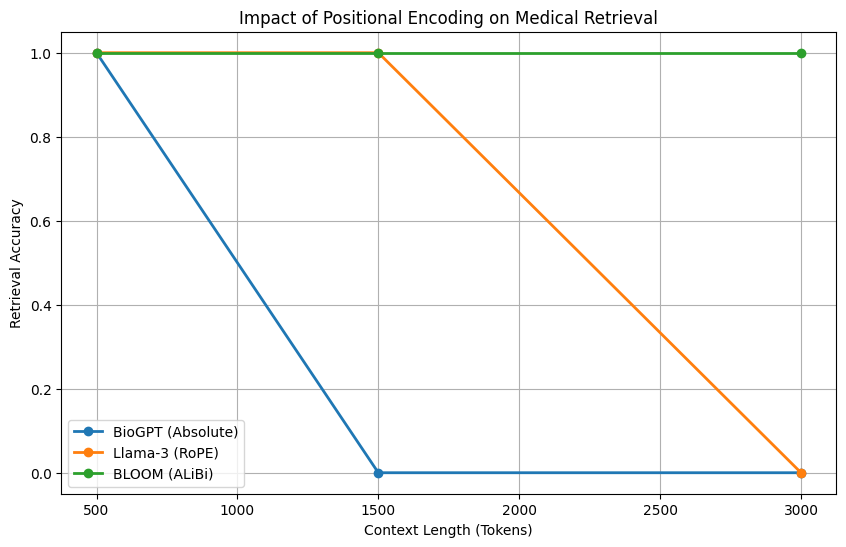

# Impact of Positional Encoding Schemes on Medical Agent Retrieval

**Author:** Rafia Shaikh 
**Course:** Agentic AI 
**Date:** December 2025

## 📄 Abstract
This repository contains the experimental code and reproducibility scripts for the research paper *"Comparative Analysis of Positional Encoding Robustness in Medical Retrieval Agents"*. The study evaluates how different Positional Encoding (PE) schemes—**Absolute (BioGPT)**, **RoPE (Llama-3)**, and **ALiBi (BLOOM)**—affect the safety and reliability of autonomous medical agents processing longitudinal patient records.
.png)

## 🧪 Key Findings
Our experiments reveal a critical safety vulnerability in standard Rotary Embedding (RoPE) models:
- **BioGPT (Absolute):** Fails due to hard truncation at 1024 tokens.
- **Llama-3 (RoPE):** Exhibits "Lost-in-the-Middle" failure, dropping to **0% accuracy** at 3000 tokens despite theoretically supporting the context length.
- **BLOOM (ALiBi):** Maintains **100% retrieval accuracy**, demonstrating superior length extrapolation for clinical tasks.



## 🛠️ Installation

```bash
# Clone the repository
git clone [https://github.com/yourusername/medical-agent-pe-analysis.git](https://github.com/yourusername/medical-agent-pe-analysis.git)

# Install dependencies
pip install -r requirements.txt
